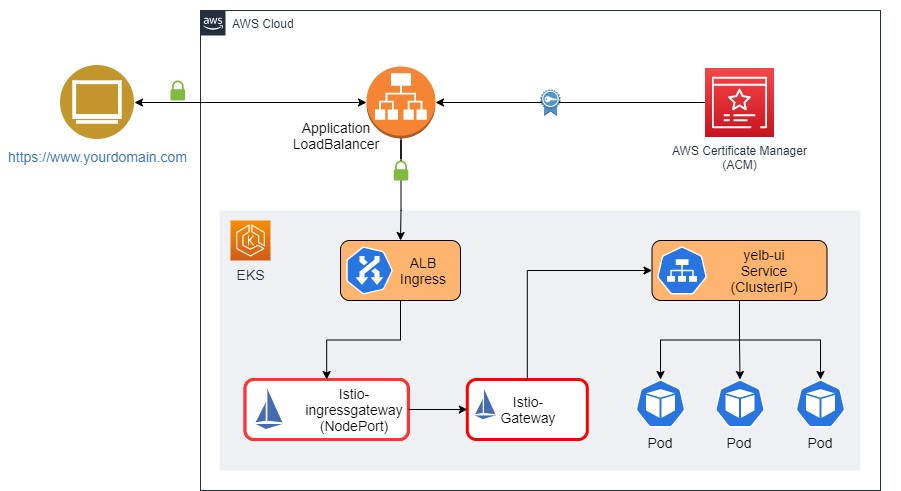

# Istio service mesh
Detail instruction on how to install Istio service mesh for EKS cluster.

## Prerequisites
* [AWS CLI v2.7+](https://docs.aws.amazon.com/cli/latest/userguide/getting-started-install.html)
* [Kubectl v1.24+](https://kubernetes.io/docs/tasks/tools/install-kubectl-linux/)
* [EKSctl v0.136+](https://docs.aws.amazon.com/eks/latest/userguide/eksctl.html)
* [Istioctl v1.21+](https://istio.io/latest/docs/setup/install/istioctl/)
* [Helm v3.8+](https://helm.sh/docs/intro/install/)
* [OpenSSL](https://www.openssl.org/)
* [K8S cluster](../k8s/README.md)

## Connect to EKS cluster
Please refer to [EKS - Connect cluster](../eks/README.md#connect-to-cluster)

## Install Istio
* Install Istio with default profile and NodePort ingress-gateway to comply with ALB Controller
```bash
$ istioctl install --set profile=default \
    --set values.gateways.istio-ingressgateway.type=NodePort -y
```

* Enable auto sidecar-injection for apps namespaces
```bash
$ kubectl label namespace default istio-injection=enabled
$ kubectl label namespace pre-prod istio-injection=enabled
$ kubectl label namespace prod istio-injection=enabled
```

* Apply common settings
```bash
$ kubectl apply -f common.yaml
```

## Add Helm repo
```bash
$ helm repo add istio https://istio-release.storage.googleapis.com/charts
$ helm repo update
``` 

## Setup ALB-Istio Ingress gateway
* Architecture


For more detail, refer to this [AWS Blog](https://aws.amazon.com/vi/blogs/containers/secure-end-to-end-traffic-on-amazon-eks-using-tls-certificate-in-acm-alb-and-istio/)


* Create Istio Gateway
```bash
$ kubectl apply -f gateway.yaml
```

## Create Virtual services
* Prerequisite: service deployed to cluster using Jenkins

* Add virtual services definition in virtual-services-helm/values.yaml
For example
```yaml
- virtualName: app1-virtual-svc
    name: app1-service
    port: 8000
    namespaces: 
      - name: prod
        hosts: 
          - app1.public.domain # public domain
          - app1-service.prod.svc.cluster.local # internal domain name
      - name: pre-prod
        hosts: 
          - app1-pre.public.domain
          - app1-service.pre-prod.svc.cluster.local # internal domain name
    prefixes:
      - /
```

* Install / upgrade virtual-services Helm release

```bash
$ helm <install | upgrade> virtual-services ./virtual-services-helm -f ./virtual-services-helm/values.yaml -n istio-system
```

* Install / upgrade ALB Ingress

```bash
$ helm <install | upgrade> alb-istio-ingress ./alb-istio-helm -f ./alb-istio-helm/<values-files>.yaml -n istio-system
```

**NOTE:** values-file is one of values-bi, values-dpl, values-protocol, which is corresponded to current team/line-products
{: .note}

* Verify ALB and Target-group is spinned up and running

* Verify connection

> - Get ALB endpoint

```bash
$ echo $(kubectl get ingress gw-ingress -n istio-system \
    -o jsonpath="{.status.loadBalancer.ingress[*].hostname}")
```

> - Make `curl` request to endpoint

```bash
$ curl -v -H "Host: <virtual-service-host>" http://<alb-endpoint>/
```

you should retrieve successful response.

## Cleanup

* Delete ALB Ingress

```bash
$ helm uninstall alb-istio-ingress -n istio-system
```

* Delete Virtual services

```bash
$ helm uninstall virtual-services -n istio-system
```

* Delete Istio gateway

```bash
$ kubectl delete -f gateway.yaml
```

* Uninstall Istio

```bash
$ istioctl uninstall --purge -y
```

* Delete Istio namespace

```bash
$ kubectl delete ns istio-system
```

## Troubleshooting
If you encounter unreachable problem with K8S internal service, please check following connections

* Connection between non sidecar-injected pod and K8S pure service

> - Spin up debug-curl pod

```bash
$ kubectl run -it debug --image=curlimages/curl --restart=Never --rm -- sh
$ curl -v http://<service-name>.<namespace>:<service-port>/
```

*Ensure that response received from service successfully.*

* Connection between non sidecar-injected pod and Istio Virtual-service via Gateway

> - Create gateway and virtual-service

```bash
$ kubectl apply -f gateway.yaml
$ kubectl apply -f virtual-services.yaml
```

> - Get Ingress-gateway Nodeport

```bash
$ kubectl get svc istio-ingressgateway -n istio-system
```
should notice the 80:<nodeport>/TCP

> - Get NodeIP

```bash
$ kubectl describe pod <istio-ingressgateway-pod-name> -n istio-system
```
the node IP is shown up in Node field


> - Spin up debug-curl pod

```bash
$ kubectl run -it debug --image=curlimages/curl --restart=Never --rm -- sh
$ curl -v -H "Host: <virtual-service-host>" http://<node-ip>:<node-port>/
```
Ensure that response received from service successfully.

* Error 'upstream connect error or disconnect/reset before headers. retried and the latest reset reason: connection failure, transport failure reason: TLS error: 268435581:SSL routines:OPENSSL_internal:CERTIFICATE_VERIFY_FAILED'
Check logs istio-proxy

```bash
$ kubectl logs <service-pod-name> -c istio-proxy -n <namespace> -f
```

if got error like '2023-11-05T04:30:28.395139Z	warning	envoy config external/envoy/source/common/config/grpc_stream.h:163	StreamSecrets gRPC config stream to sds-grpc closed: 2, failed to generate secret for default: failed to generate workload certificate: create certificate: rpc error: code = Unavailable desc = connection error: desc = "transport: authentication handshake failed: tls: failed to verify certificate: x509: certificate signed by unknown authority (possibly because of \"crypto/rsa: verification error\" while trying to verify candidate authority certificate \"cluster.local\")"	thread=16'
then you should re-deploy the service via Jenkins