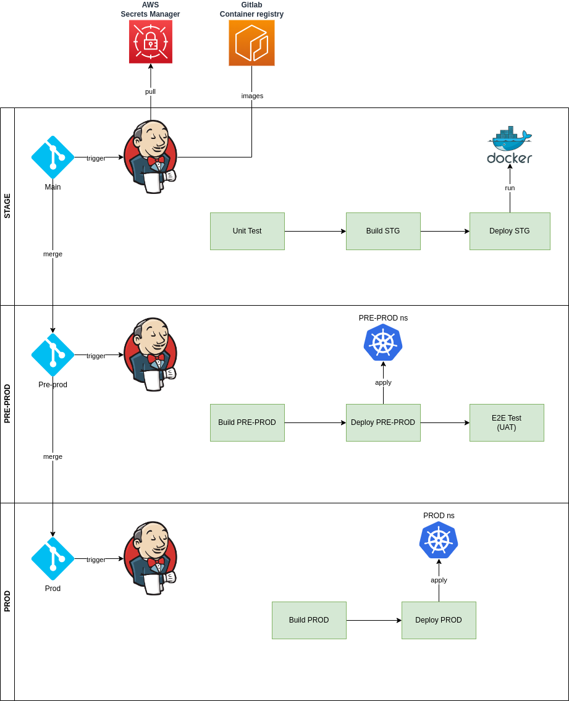

# Jenkins CICD
Detail instruction on how to setup Jenkins CICD pipeline.

## CICD Pipeline


Deployment environments:
* STAGE: hosted on singleton EC2 instance, services running as docker containers
* PRE-PROD: *pre-prod* namespace on k8s cluster
* PROD: *prod* namespace on k8s cluster

Main components:
* Gitlab code repository
* Jenkins server: multi-branch pipeline configuration
* AWS Secret Manager for secrets / credentials management
* Gitlab Container registry for docker images repository

## Prerequisites
* [AWS CLI v2.7+](https://docs.aws.amazon.com/cli/latest/userguide/getting-started-install.html)
* [Kubectl v1.24+](https://kubernetes.io/docs/tasks/tools/install-kubectl-linux/)
* [AWS account with access credentials](https://console.aws.amazon.com)

## Install
* Refer to [Setup Jenkins on Amazon linux 2023](https://cloudkatha.com/how-to-install-jenkins-on-amazon-linux-2023-step-by-step/) for detail instruction.

## Config Nginx
* Use jenkins_nginx.conf for a template for config Jenkins on Nginx
* Refer to [Setup SSL for Jenkins on nginx](https://www.jenkins.io/doc/book/system-administration/reverse-proxy-configuration-with-jenkins/reverse-proxy-configuration-nginx/) for detail.

## Connect to EKS cluster

Follow connect step on [EKS cluster](../eks/README.md#connect-to-cluster)

* Retrieve available cluster

```sh
$ aws eks --region <eks-region> list-clusters
```

* Update kubeconfig

```sh
$ aws eks --region <eks-region> update-kubeconfig \
    --name <cluster-name>
```

* Verify connection

```sh
$ kubectl config get-contexts
$ kubectl cluster-info
$ kubectl get nodes
```

## Install Plugin Cobertura for UT Report
* [Cobertura](https://plugins.jenkins.io/cobertura/) is a tool generate unit test report and show it on jenkin cicd flow. It is install directly on Jenkin Web UI. <br>
Go to `Dashboard` => `Manage Jenkins` => `Plugins` => `Available plugins`, search _Cobertura_, on `Cobertura Plugin` check and click `Download now and install after restart`. <br>
After restart Jenkins, Cobertura Plugin will automatic collect coverage report on UT for us.

## (Note!) Cron job docker prune to avoid device run out of space
* Install crontab package:

```sh
sudo yum install cronie -y
```

* Enable and start crontab service:

```sh
sudo systemctl enable crond.service
sudo systemctl start crond.service
```

* Edit cront job for current user:
```sh
crontab -e
```

* Setting cront job remove all old resource (> 5 day ago) every day at 0 a.m:

```sh
0 0 * * * docker system prune -af --filter "until=120h"
```

## TODO
* Ansible playbook for Jenkins server